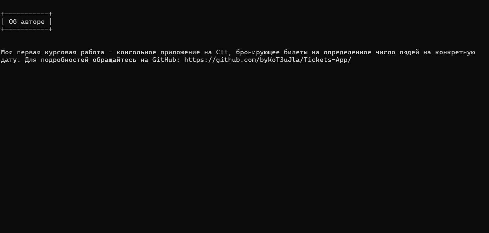
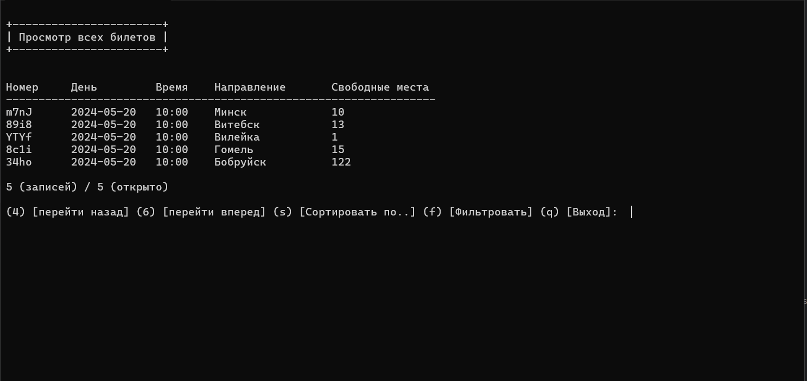
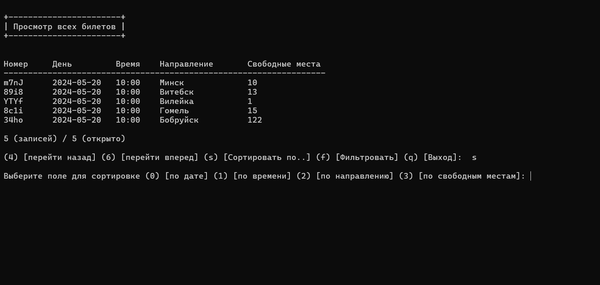
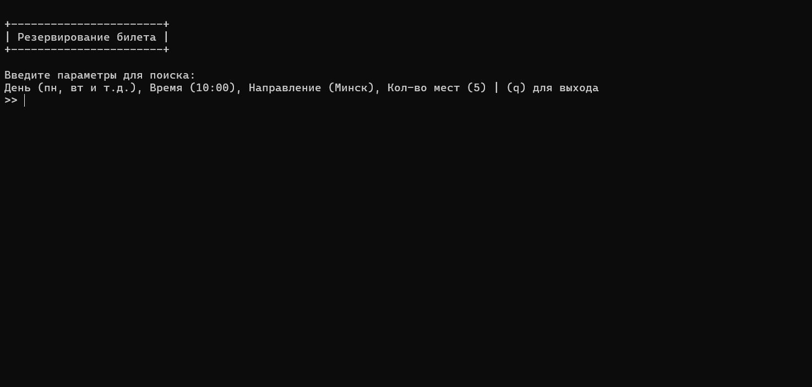
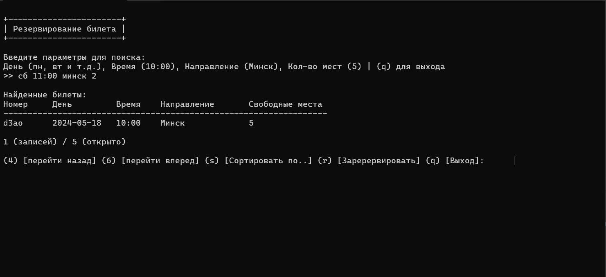
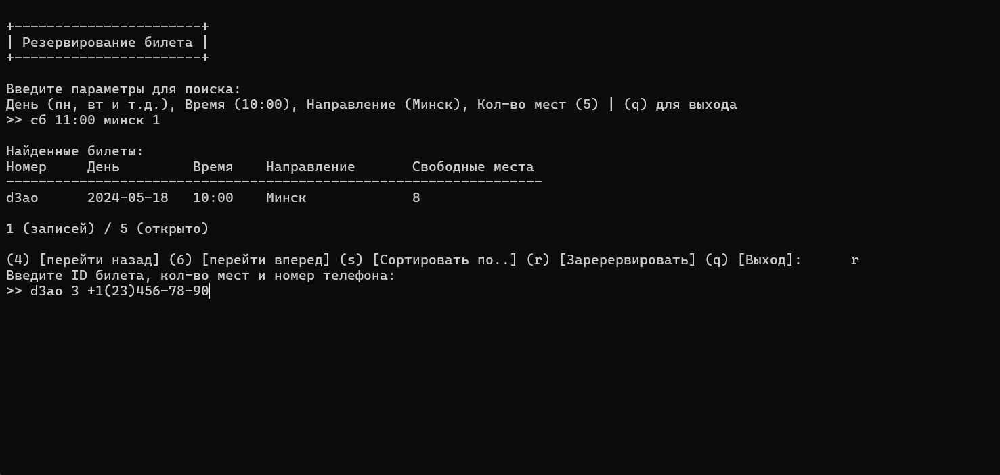

# Tickets-App

Главное меню консольного приложения для поиска билетов
Меню простое и интуитивно понятное, с пятью вариантами на выбор для пользователя:
1. Просмотреть зарезервированные билеты
   Этот пункт позволяет пользователям просматривать список уже зарезервированных билетов.
2. Зарезервировать билет
   Пользователи могут выбрать этот вариант, чтобы забронировать билет на определенное мероприятие или маршрут.
3. Просмотреть все билеты
   Этот пункт отображает полный список всех доступных билетов, включая такие детали, как цены, даты и направления.
4. Об авторе
   Для тех, кто хочет узнать больше о создателе приложения, этот пункт предоставляет информацию об авторе.
5. Выход
   Пользователи могут выйти из приложения, выбрав этот вариант.

Меню представлено ясно и лаконично, что облегчает пользователям навигацию и поиск необходимого функционала. Простота и удобство использования консольного приложения делают его идеальным решением для быстрого поиска и бронирования билетов.

**Об авторе**

**Просмотр всех билетов**

Окно "Просмотр всех билетов" предоставляет пользователям возможность удобного просмотра и управления всеми билетами в системе, а также позволяет сортировать их по различным категориям. Вот основные функции этого окна:
1. Отображение списка билетов

   Пользователи могут просматривать полный список всех билетов, доступных в системе.
   Каждый билет отображается с информацией о дате, времени, направлении и количестве доступных мест.
2. Сортировка по категориям

   Пользователи могут сортировать билеты по различным категориям, таким как дата, время, направление и количество мест.
   Это позволяет пользователям быстро находить нужные билеты и организовывать их по заданным критериям.

**Резервирование билетов**

Приложение предоставляет удобный интерфейс для поиска билетов с учетом различных параметров, таких как день недели, время отправления, направление и количество пассажиров. Пользователь может легко настроить поиск, указав необходимые критерии, чтобы найти оптимальные варианты билетов.
Функционал:
1. Параметры поиска:

   * Пользователь может выбрать день недели, время отправления, направление и указать количество пассажиров для поиска билетов.
2. Результаты поиска:

   * После ввода параметров поиска, приложение отобразит подходящие варианты билетов с учетом заданных критериев.

3. Бронирование билетов:
    * После выбора подходящего билета, пользователь может зарезервировать его, указав уникальный ID билета, количество пассажиров и номер телефона для связи.

